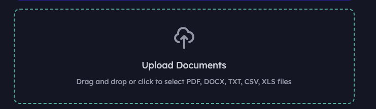
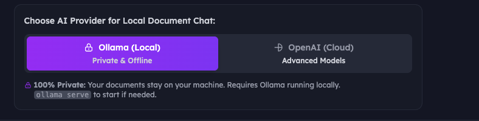
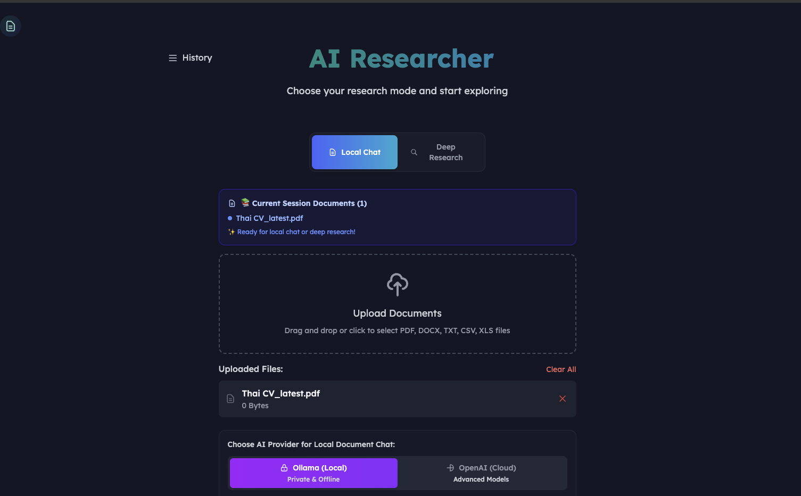
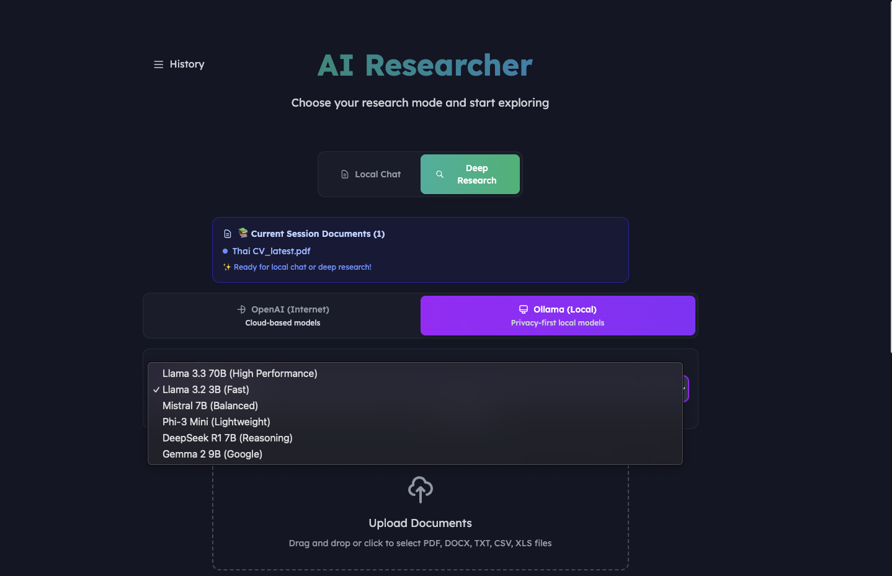
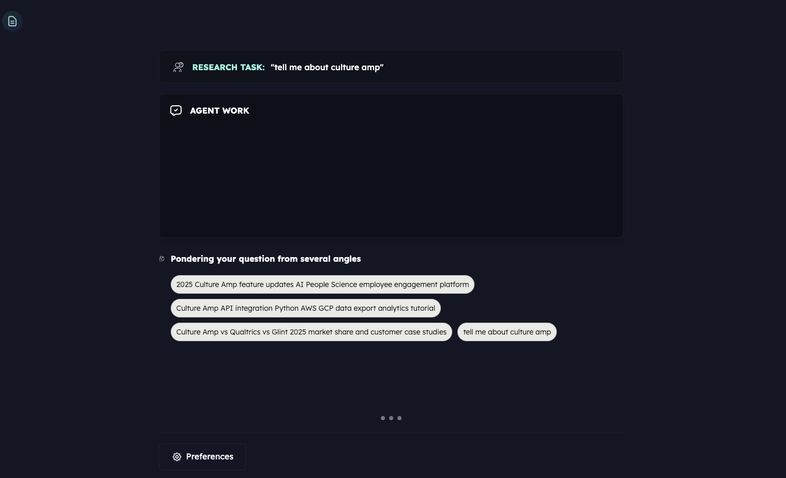
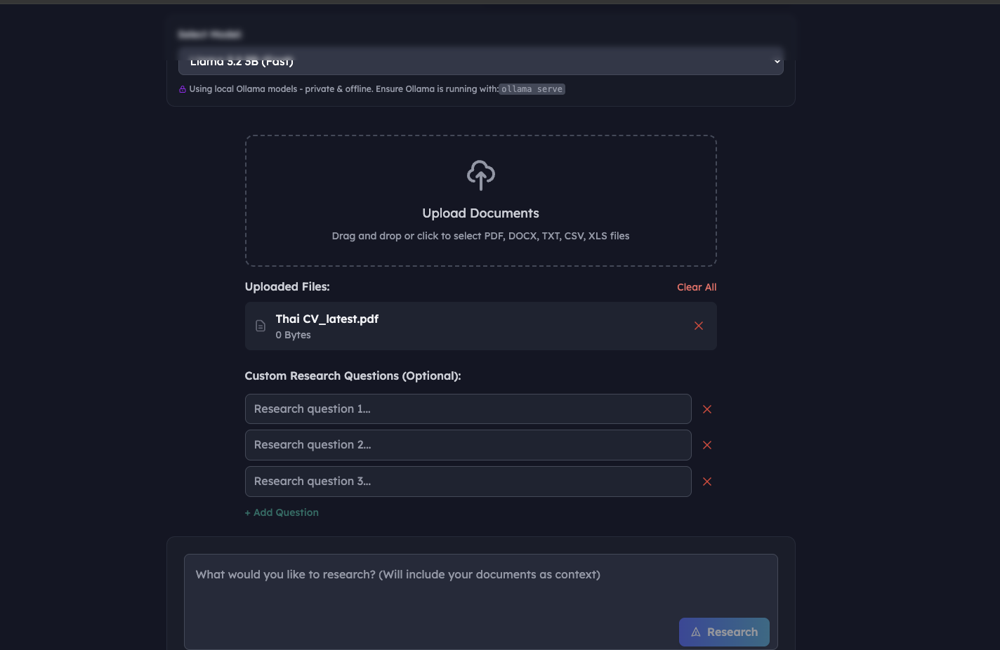

# 🔬 AI Researcher - User Guide

Welcome to AI Researcher! This guide will walk you through everything you need to know to get the most out of your AI-powered research assistant.

*Main interface of AI Researcher*

## 📋 Table of Contents

1. [Getting Started](#getting-started)
2. [Understanding the Interface](#understanding-the-interface)
3. [Local Chat Mode](#local-chat-mode)
4. [Deep Research Mode](#deep-research-mode)
5. [Provider Selection (Ollama vs OpenAI)](#provider-selection)
6. [File Management](#file-management)
7. [Advanced Features](#advanced-features)
8. [Troubleshooting](#troubleshooting)

---

## 🚀 Getting Started

### Prerequisites
- Python 3.8+
- Node.js 18+
- Ollama (for local AI models)
- OpenAI API key (for cloud models)

### Quick Setup
1. **Clone and install dependencies:**
   ```bash
   git clone https://github.com/assafelovic/gpt-researcher
   cd gpt-researcher
   pip install -r requirements.txt
   cd frontend/nextjs && npm install
   ```

2. **Configure environment:**
   ```bash
   # Copy and edit your .env file
   cp .env.example .env
   # Add your API keys and settings
   ```

3. **Start the services:**
   ```bash
   # Terminal 1: Start backend
   uvicorn backend.server.server:app --host=0.0.0.0 --port=8000 --reload

   # Terminal 2: Start frontend  
   cd frontend/nextjs && npm run dev
   ```

4. **Access the application:**
   Open `http://localhost:3000` in your browser

---

## 🎯 Understanding the Interface

*Main components of the AI Researcher interface*

### Key Components

1. **🏠 Header** - Navigation and branding
2. **📚 Mode Selection** - Choose between Local Chat and Deep Research
3. **📁 File Upload Area** - Drag and drop your documents
4. **⚙️ Provider Toggle** - Switch between Ollama (local) and OpenAI (cloud)
5. **💬 Chat Interface** - Input area and conversation history
6. **📊 Results Display** - Research outputs and analysis

---

## 💬 Local Chat Mode

Local Chat mode lets you have conversations with your uploaded documents using either local or cloud AI models.

### Step 1: Upload Documents


*Drag and drop files or click to select*

1. **Drag and drop** files into the upload area, or **click to browse**
2. **Supported formats:** PDF, DOCX, TXT, MD, CSV, XLS, XLSX
3. **Multiple files** can be uploaded at once
4. Files are automatically processed and ready for chat

### Step 2: Select Local Chat Mode


*Choose Local Chat for document-only conversations*

- Click the **"Local Chat"** button (blue)
- This mode focuses only on your uploaded documents
- No internet search is performed

### Step 3: Choose Your AI Provider


*Select between Ollama (private) and OpenAI (cloud)*

**Ollama (Local & Private):**
- ✅ 100% privacy - data never leaves your machine
- ✅ No API costs
- ✅ Works offline
- ⚠️ Requires Ollama to be running locally
- ⚠️ May be slower than cloud models

**OpenAI (Cloud):**
- ✅ Latest AI models (GPT-4o, etc.)
- ✅ Faster responses
- ✅ Advanced reasoning capabilities
- ⚠️ Requires internet connection
- ⚠️ Uses API credits

### Step 4: Start Chatting


*Chat interface with conversation history*

1. **Type your question** about the documents
2. **Press Enter** or click the **"Chat"** button
3. **Watch the loading indicator** while AI processes your request
4. **View the response** based on your document content

### Example Questions:
- "What are the main findings in this research paper?"
- "Summarize the key points from these meeting notes"
- "What budget items are mentioned in the financial report?"
- "Compare the approaches described in these documents"

---

## 🔍 Deep Research Mode

Deep Research mode combines your documents with internet search for comprehensive analysis.

### Step 1: Select Deep Research Mode


*Deep Research mode for comprehensive analysis*

- Click the **"Deep Research"** button (teal)
- This mode uses both your documents AND internet sources
- Provides more comprehensive and current information

### Step 2: Configure Research Settings


*Advanced provider and model selection*

1. **Choose Provider:** OpenAI or Ollama
2. **Select Model:** Different models for different needs
   - GPT-4o: Most advanced, best for complex analysis
   - GPT-4o Mini: Fast and efficient for most tasks
   - Mistral 7B: Local alternative, good balance
3. **Optional:** Add custom research questions

### Step 3: Run Research


*Real-time research progress and results*

1. **Enter your research topic**
2. **Click "Research"** to start
3. **Watch real-time progress** as sources are found and analyzed
4. **Review comprehensive report** with citations and sources

### Research Output Includes:
- **Executive Summary**
- **Detailed Analysis** 
- **Source Citations**
- **Related Documents** from your uploads
- **Downloadable Reports** (PDF, DOCX)

---

## ⚙️ Provider Selection

### Ollama (Local AI)

*Ollama local setup and model selection*

**Setup Requirements:**
1. **Install Ollama:** `brew install ollama` (macOS) or visit [ollama.ai](https://ollama.ai)
2. **Start Ollama:** `ollama serve`
3. **Download models:** `ollama pull mistral:7b`

**Available Models:**
- **Mistral 7B** - Balanced performance and speed
- **Llama 3.2 3B** - Fast and lightweight
- **Llama 3.3 70B** - Highest quality (requires more RAM)
- **Phi-3 Mini** - Microsoft's efficient model
- **DeepSeek R1** - Great for reasoning tasks

**Best For:**
- 🔒 Privacy-sensitive documents
- 💰 Cost-conscious usage
- 🌐 Offline environments
- 🏠 Personal projects

### OpenAI (Cloud AI)

*OpenAI API configuration and model options*

**Setup Requirements:**
1. **Get API Key** from [platform.openai.com](https://platform.openai.com)
2. **Add to .env file:** `OPENAI_API_KEY=your_key_here`
3. **Monitor usage** on OpenAI dashboard

**Available Models:**
- **GPT-4o** - Most advanced, best reasoning
- **GPT-4o Mini** - Fast, cost-effective
- **GPT-4 Turbo** - Good balance of speed and capability

**Best For:**
- 🧠 Complex analysis and reasoning
- 🚀 Fastest response times
- 📈 Professional/business use
- 🌍 Latest information synthesis

---

## 📁 File Management

### Supported File Types

*Supported document formats*

| Format | Extension | Best For |
|--------|-----------|----------|
| PDF | `.pdf` | Research papers, reports, presentations |
| Word | `.docx`, `.doc` | Documents, proposals, notes |
| Text | `.txt`, `.md` | Code, documentation, plain text |
| Spreadsheet | `.xlsx`, `.xls`, `.csv` | Data, financial reports, logs |

### File Operations

*File upload, preview, and management interface*

**Upload:**
- **Drag & Drop** multiple files at once
- **Click to browse** for traditional file selection
- **Automatic processing** extracts text content
- **Real-time feedback** shows upload progress

**Manage:**
- **View uploaded files** with size and type info
- **Remove individual files** using the X button
- **Clear all files** with the "Clear All" button
- **Auto-refresh** checks for new files every 5 seconds

### Session Persistence

*Current session documents display*

- **Files persist** between browser sessions
- **Document indicator** shows current files on startup
- **Ready status** confirms documents are processed
- **File count** displays total available documents

---

## 🔧 Advanced Features

### Custom Research Questions


*Define specific research questions for targeted analysis*

In Deep Research mode, you can add custom questions:
1. Click **"+ Add Question"**
2. Enter specific research angles
3. Click **"Research These Questions"**
4. Get targeted analysis for each question

### Chat History Management


*Conversation history and context management*

- **Persistent conversations** within sessions
- **Context awareness** - AI remembers previous questions
- **Visual indicators** for user vs assistant messages
- **Scrollable history** for long conversations

### Research History Sidebar

*Access previous research sessions*

- **Saved research** automatically stored
- **Quick access** to previous analyses
- **Delete options** for cleanup
- **Export functionality** for reports

### Real-time Progress Tracking

*Live research progress and source discovery*

- **Source discovery** shows websites being analyzed
- **Processing steps** display current AI operations
- **Time estimates** help manage expectations
- **Cancel option** to stop long-running research

---

## 🛠️ Troubleshooting

### Common Issues

#### 1. "Provider toggle not showing"

*Provider toggle requires uploaded documents*

**Solution:**
- ✅ Upload at least one document first
- ✅ Select "Local Chat" mode
- ✅ Toggle will appear below uploaded files

#### 2. "Ollama not responding"

*Ollama connection troubleshooting*

**Solutions:**
```bash
# Check if Ollama is running
curl http://localhost:11434/api/tags

# Start Ollama service
ollama serve

# Pull required models
ollama pull mistral:7b
ollama pull mxbai-embed-large
```

#### 3. "OpenAI API errors"

*OpenAI API troubleshooting*

**Solutions:**
- ✅ Check API key in `.env` file
- ✅ Verify billing and credits on OpenAI dashboard
- ✅ Test API key: `curl https://api.openai.com/v1/models -H "Authorization: Bearer YOUR_KEY"`

#### 4. "File upload failures"


*File upload troubleshooting*

**Solutions:**
- ✅ Check file size (max 50MB per file)
- ✅ Verify file format is supported
- ✅ Clear browser cache and cookies
- ✅ Check backend is running on port 8000

#### 5. "Chat button stuck loading"


*Chat loading state troubleshooting*

**Solutions:**
- ✅ Check browser console for errors
- ✅ Verify backend connection
- ✅ Refresh the page and try again
- ✅ Check if Ollama/OpenAI service is responding

### Performance Tips

**For Best Results:**
- 📄 **Document Quality:** Clean, well-formatted documents work best
- 🧠 **Model Selection:** Use GPT-4o for complex analysis, Mistral for speed
- 💾 **File Management:** Keep document count reasonable (< 50 files)
- 🔄 **Regular Cleanup:** Clear old files to improve performance
- 🌐 **Network:** Stable internet connection for cloud providers

### Getting Help

**Debug Information:**
- Check browser console (F12) for error messages
- View backend logs in the terminal
- Test API endpoints directly with curl
- Verify environment variables are loaded

**Support Resources:**
- 📖 [Project Documentation](https://docs.gptr.dev/)
- 💬 [GitHub Issues](https://github.com/assafelovic/gpt-researcher/issues)
- 🌟 [Community Discord](https://discord.gg/gptr)

---

## 🎉 Tips for Success

### Effective Questioning

**Good Questions:**
- ✅ "What are the main recommendations in these strategy documents?"
- ✅ "Compare the financial performance across these quarterly reports"
- ✅ "Summarize the key technical specifications mentioned"

**Less Effective:**
- ❌ "Tell me everything about these files"
- ❌ "What do you think?"
- ❌ Very broad questions without context

### Document Organization

**Best Practices:**
- 📁 **Group related documents** for coherent analysis
- 📝 **Use descriptive filenames** 
- 🗂️ **Clear out old files** when switching topics
- 📊 **Mix document types** for comprehensive insights

### Provider Strategy

**Ollama When:**
- 🔒 Privacy is paramount
- 💰 Controlling costs
- 🏠 Working offline
- 📚 Simple document Q&A

**OpenAI When:**
- 🧠 Complex reasoning needed
- 🚀 Speed is important
- 🌍 Need latest information
- 💼 Professional analysis

---

Enjoy using AI Researcher! 🚀

*Last updated: January 2025* 